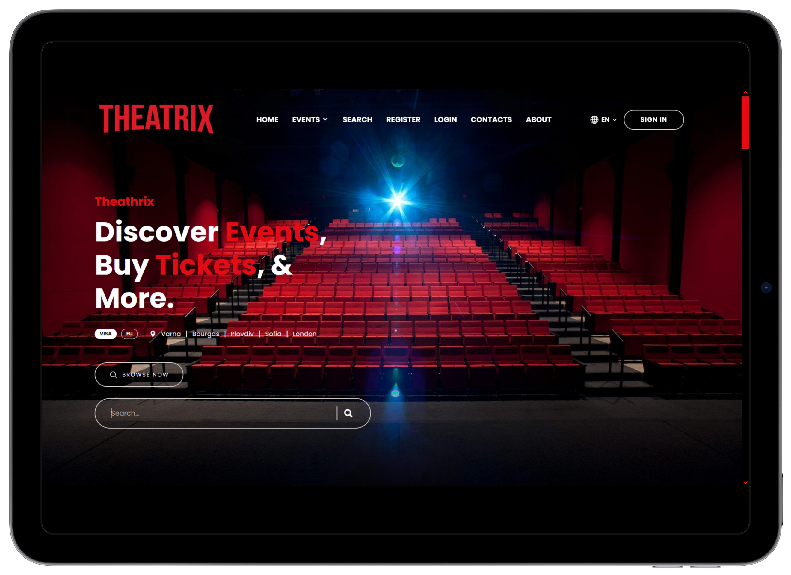

<div align="center">
  
  
  
  

  <br />
  <br />
  
  

  <h2 align="center">Theatrix - a Netflix Inspired Theater HTML Template</h2>
 
  <br />
  
  Theatrix is a HTML template, built as a base template for my projects @ SoftUni </br>
  
  Used in Theatrix-Express and Theatrix-Angular apps <br />
  
  Fully responsible, built using HTML, CSS and JavaScript.  <br />
 
  <br />


### Screenshots

  
    <br />
    <br />
  
  

  </div>

### Prerequisites

Before you begin, ensure you have met the following requirements:

* [Git](https://git-scm.com/downloads "Download Git") must be installed on your operating system.

<br />
  
### Run Locally

To run **Theatrix** locally, run this command on your git bash:

Linux and macOS:

```bash
sudo git clone https://github.com/Divanov87/Theatrix---HTML-Template.git
```

Windows:

```bash
git clone https://github.com/Divanov87/Theatrix---HTML-Template.git
```

<br />

### License
Free. Just dont pretend that the author is you.
